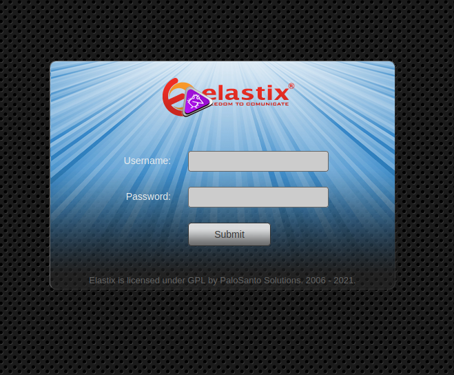

# First step

La première chose que je fais que je m'attaque à une box HTB c'est d'ajouter la résolution de nom <box>.htb à mon fichier /etc/hosts:

`echo "10.129.152.59	beep.htb"`

# Enumération des ports 

Scannons d'abords tout les ports:

`nmap 10.129.151.94 -p-` 

```
PORT      STATE SERVICE
22/tcp    open  ssh
25/tcp    open  smtp
80/tcp    open  http
110/tcp   open  pop3
111/tcp   open  rpcbind
143/tcp   open  imap
443/tcp   open  https
944/tcp   open  unknown
993/tcp   open  imaps
995/tcp   open  pop3s
3306/tcp  open  mysql
4190/tcp  open  sieve
4445/tcp  open  upnotifyp
4559/tcp  open  hylafax
5038/tcp  open  unknown
10000/tcp open  snet-sensor-mgmt
```

Nous effectuons maintenant un scan plus complet sur les ports désignés (option -p):

`nmap 10.129.151.94 -p 22,25,80,110,111,143,443,944,993,995,3306,4190,4445,4559,5038,10000 -A `

```
22/tcp    open  ssh        OpenSSH 4.3 (protocol 2.0)
| ssh-hostkey: 
|   1024 ad:ee:5a:bb:69:37:fb:27:af:b8:30:72:a0:f9:6f:53 (DSA)
|_  2048 bc:c6:73:59:13:a1:8a:4b:55:07:50:f6:65:1d:6d:0d (RSA)
25/tcp    open  smtp?
|_smtp-commands: beep.localdomain, PIPELINING, SIZE 10240000, VRFY, ETRN, ENHANCEDSTATUSCODES, 8BITMIME, DSN, 
80/tcp    open  http       Apache httpd 2.2.3
|_http-server-header: Apache/2.2.3 (CentOS)
|_http-title: Did not follow redirect to https://10.129.151.94/
|_https-redirect: ERROR: Script execution failed (use -d to debug)
110/tcp   open  pop3?
111/tcp   open  rpcbind    2 (RPC #100000)
143/tcp   open  imap?
443/tcp   open  ssl/https?
|_ssl-date: 2021-05-25T14:38:08+00:00; 0s from scanner time.
944/tcp   open  status     1 (RPC #100024)
993/tcp   open  imaps?
995/tcp   open  pop3s?
3306/tcp  open  mysql?
|_mysql-info: ERROR: Script execution failed (use -d to debug)
4190/tcp  open  sieve?
4445/tcp  open  upnotifyp?
4559/tcp  open  hylafax?
5038/tcp  open  asterisk   Asterisk Call Manager 1.1
10000/tcp open  http       MiniServ 1.570 (Webmin httpd)
|_http-server-header: MiniServ/1.570
|_http-title: Site doesn't have a title (text/html; Charset=iso-8859-1).
```

# Site Web http:// deep.htb  et https:// deep.htb

Le site force l'usage d'HTTPS, il n'y a donc "rien à voir" sur le port 80 et nous sommes redirigés vers le port 443.

Il s'agit d'Elastix: 


