# Box 

```diff
+ Niveau: Facile à Intermédiaire
```

Cette box à été écrite par IPPSec, elle est originale et fais appelle à différentes techniques.

* Enumération Web
* usurpation d'identité par e-mail
* Virtual Host
* MySQL
* Hashcat
	* bcrypt password crack 
	* Utilisation de règle pour dériver un mot.

# FootHold

Avant toute chose, comme pour toute machine su HTB, on ajoute le nom de domaine de la machine à notre fichier hosts:

	sudo echo "10.129.148.201	delivery.htb" >> /etc/hosts


## Découverte des services - nmap 
Après avoir lancé un nmap classique, il semblat intéresant de prendre le temps de tout scanner, c'est pourquoi j'ai décidé d'ajouter l'option `-p-`

```
nmap delivery.htb -p-
```


	PORT     STATE SERVICE
	22/tcp   open  ssh
	80/tcp   open  http
	8065/tcp open  unknown

Maintenant que nous avons la liste complète des ports ouverts sur la machine, je fais un scan plus approfondit sur ces ports là uniquement:

```
nmap delivery.htb -A -p 22,80,8065
```

	PORT     STATE SERVICE VERSION
	22/tcp   open  ssh     OpenSSH 7.9p1 Debian 10+deb10u2 (protocol 2.0)
	| ssh-hostkey: 
	|   2048 9c:40:fa:85:9b:01:ac:ac:0e:bc:0c:19:51:8a:ee:27 (RSA)
	|   256 5a:0c:c0:3b:9b:76:55:2e:6e:c4:f4:b9:5d:76:17:09 (ECDSA)
	|_  256 b7:9d:f7:48:9d:a2:f2:76:30:fd:42:d3:35:3a:80:8c (ED25519)
	80/tcp   open  http    nginx 1.14.2
	|_http-server-header: nginx/1.14.2
	|_http-title: Welcome
	8065/tcp open  unknown
	| fingerprint-strings: 
	|   GenericLines, Help, RTSPRequest, SSLSessionReq, TerminalServerCookie: 
	|     HTTP/1.1 400 Bad Request
	|     Content-Type: text/plain; charset=utf-8
	|     Connection: close
	|     Request
	|   GetRequest: 
	|     HTTP/1.0 200 OK
	|     Accept-Ranges: bytes
	|     Cache-Control: no-cache, max-age=31556926, public
	|     Content-Length: 3108
	|     Content-Security-Policy: frame-ancestors 'self'; script-src 'self' cdn.rudderlabs.com
	|     Content-Type: text/html; charset=utf-8
	|     Last-Modified: Wed, 19 May 2021 12:41:00 GMT
	|     X-Frame-Options: SAMEORIGIN
	|     X-Request-Id: 6kwiyx197fryjggk1dmexd8pzy
	|     X-Version-Id: 5.30.0.5.30.1.57fb31b889bf81d99d8af8176d4bbaaa.false
	|     Date: Thu, 20 May 2021 07:05:58 GMT
	|     <!doctype html><html lang="en"><head><meta charset="utf-8"><meta name="viewport" content="width=device-width,initial-scale=1,maximum-scale=1,user-scalable=0"><meta name="robots" content="noindex, nofollow"><meta name="referrer" content="no-referrer"><title>Mattermost</title><meta name="mobile-web-app-capable" content="yes"><meta name="application-name" content="Mattermost"><meta name="format-detection" content="telephone=no"><link re
	|   HTTPOptions: 
	|     HTTP/1.0 405 Method Not Allowed
	|     Date: Thu, 20 May 2021 07:05:58 GMT
	|_    Content-Length: 0


## Services Web

### Enumération Web

Je lance des énumérations Web en tâche de fond, avant de commencer l'exploration des différents services web:

```
gobuster dir -u http://delivery.htb -w /usr/share/wordlist/dirbuster/directory-list-2.3-medium.txt -x html,php,txt

gobuster dir -u http://delivery.htb:8065 -w /usr/share/wordlist/dirbuster/directory-list-2.3-medium.txt -x html,php,txt
```

## http:// delivery.htb


Cette page nous indique que si nous voulons nous créer un compte il faut qu'on se rende sur la page "helpdesk".
En cliquant dessus, on voit que le serveur utilise un hôte virtuel (virtualhost)


## VirtualHost - http:// helpdesk.delivery.htb

### Accès au service helpdesk

La page pour ouvrir un ticket et se créer un compte se trouve sous l'hôte virtuel helpdesk.delivery.htb. Ajoutons cette resolution à notre fichier hosts

	sudo echo "10.129.148.201	helpdesk.delivery.htb" >> /etc/hosts
	
### Ouverture d'un compte

Essayons d'ouvrir un ticket:

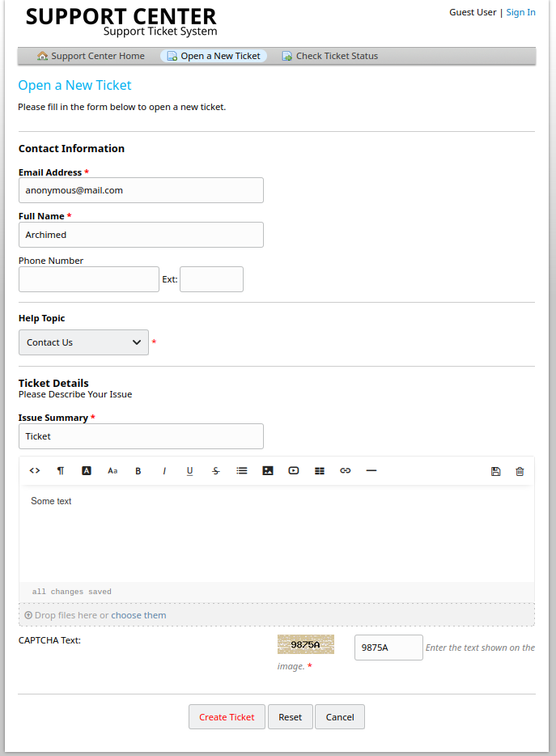

Après avoir ouvert le ticket un message apparait et nous indique que si nous voulons ajouter des informations à ce ticket nous pouvons envoyer un email à `5526743@delivery.htb`. 
Même si cette email n'est pas vraiment "réel", il nous sera utile pour la suite, notons le quelque part..

Quelques notes: 

	anonymous@mail.com
	5526743@delivery.htb
	5526743

## http:// delivery.htb:8065/

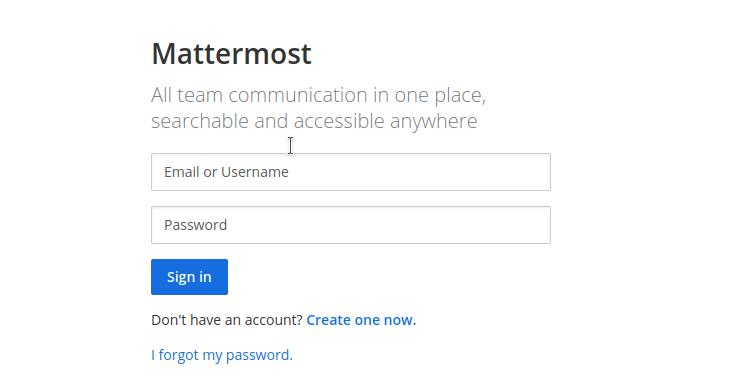

Il s'agit d'un `Mattermost`, essayons de nous créer un compte sur ce dernier. 
Etant donné qu'il d'une box HTB hébergé sur les serveur HTB accessile uniquement via VPN, sans avoir à essayer nous savons déjà qu'il ne sera pas possible d'utiliser un vraie adresse mail pour se créer un compte (cela ne ressemble pas à l'esprit HTB de toute façon).

Essayons alors d'envoyer le mail à l'adresse utilisé pour mettre à jour les tickets; de ce fait, on pourra surement voir le mail de vérification au travers de notre ticket:

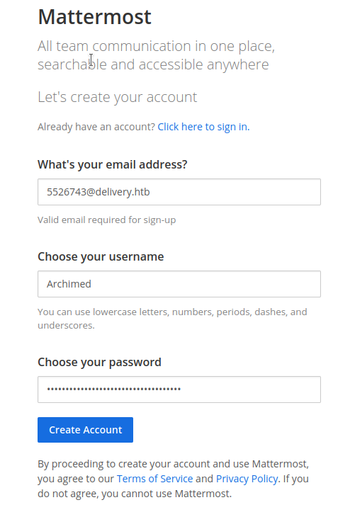


On se rend sur http://helpdesk.delivery.htb et sur "check status"

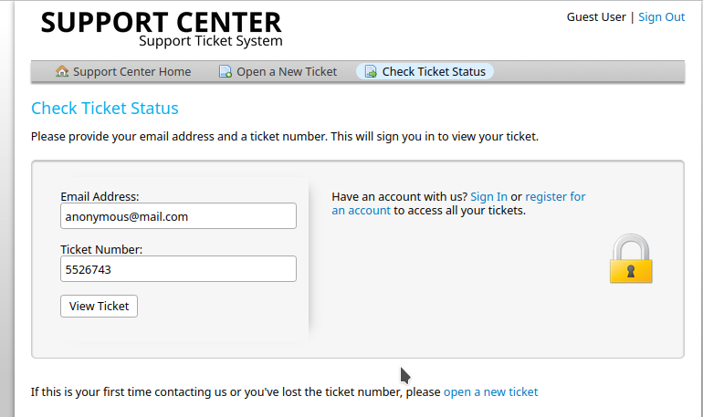

* * *

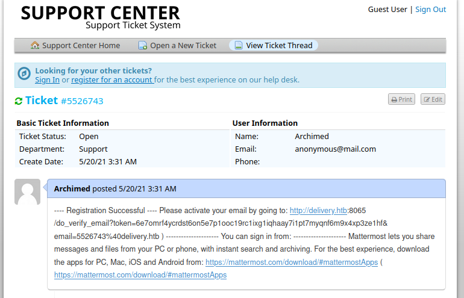

On se rend alors sur `http://delivery.htb:8065/do_verify_email?token=6e7omrf4ycrdst6on5e7p1ooc19rc1ixg1iqhaay7i1pt7myqnf6m9x4xp3ze1hf&email=5526743%40delivery.htb` pour valider notre compte.

Puis on se connecte avec notre username(ou mail 5526743@delivery.htb) et password.

# User 

## Accès SSH 

Une fois connecté, en se rendant dans le channel "internal", nous avons accès à une discussion intéressante:

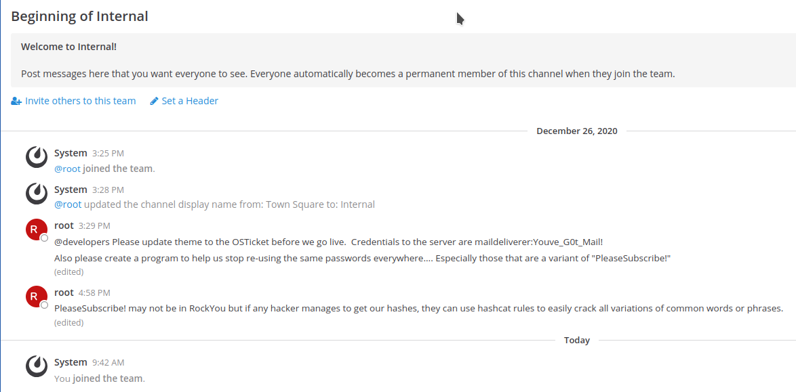

Essayons donc de se connecter en SSH à l'aide de ces credentials:

	maildeliverer:Youve_G0t_Mail!
	
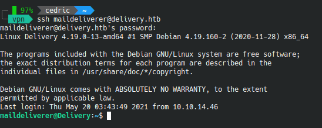


# Root 

## Enumération Linux

J'ai essayé plusieurs outils d'énumération tels que:

linpeas.sh [ici](https://github.com/carlospolop/privilege-escalation-awesome-scripts-suite/tree/master/linPEAS)

lse.sh [ici](https://github.com/diego-treitos/linux-smart-enumeration)

## Base de donnée - MariaDB

D'après le message laissé par "root" sur le chat interne de mattermost, il va nous falloir cracker un hash.
Lorsqu'on s'interesse aux connexion locales, on remarque qu'une base de donnée mysql est présente en lolcalhost uniquement: 

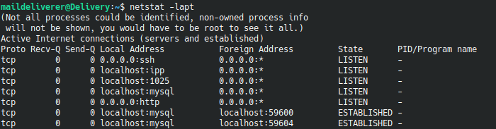

Il semble intéressant d'essayer de se connecter à cette base de donnée. 

Après plusieurs tentative de connexions et quelques temps passé à chercher sur la machine, on trouve un répertoire intéressant: `/opt/mattermost/config/` dans lequel se trouve un fichier `config.json`:

	[...]
    "SqlSettings": {
        "DriverName": "mysql",
        "DataSource": "mmuser:Crack_The_MM_Admin_PW@tcp(127.0.0.1:3306)/mattermost?charset=utf8mb4,utf8\u0026readTimeout=30s\u0026writeTimeout=30s",
        "DataSourceReplicas": [],
        "DataSourceSearchReplicas": [],
        "MaxIdleConns": 20,
        "ConnMaxLifetimeMilliseconds": 3600000,
        "MaxOpenConns": 300,
        "Trace": false,
        "AtRestEncryptKey": "n5uax3d4f919obtsp1pw1k5xetq1enez",
        "QueryTimeout": 30,
        "DisableDatabaseSearch": false
	[...]
	
	
On se connecte alors à la base de donnée avec les crédentials trouvé:

	mysql -u mmuser -p

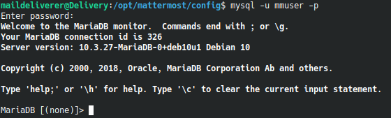

Dans la base de donnée `mattermost`

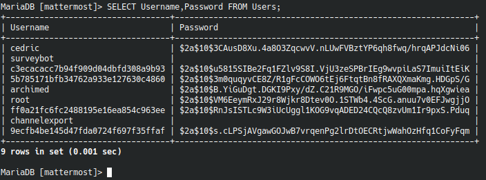

L'objectif est donc de cracker le hash suivant:
`$2a$10$VM6EeymRxJ29r8Wjkr8Dtev0O.1STWb4.4ScG.anuu7v0EFJwgjjO` 

De plus d'après les infos laissé par l'utilisateur root dans le chat de mattermost, le mot de passe devrait être "crackable" à l'aide de hashcat en s'appuyant sur un jeu de règles sur le mot de passe `PleaseSubscribe!`

Nous avons donc ces deux fichiers dans notre répertoire courant:
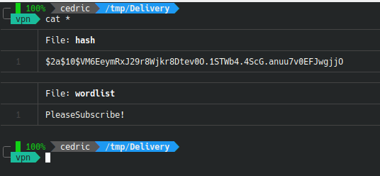

Après avoir consulté la liste des règles déjà écrite dans `/usr/share/hashcat/rules/` j'ai choisi d'utiliser la wordlist `d3adOne.rule`

Nous avons donc notre dictionnaire ("wordlist"), notre hash et nos règles pour dériver le(s) termes du dictionnaire. Il ne reste plus qu'à identifier le type de hash dont il s'agit. 

Une rapide recherche sur internet (ou un outil comme `hash-identifier`) nous indique qu'il s'agit de bcrypt (facilement reconnaissable à sa forme `$2a$10$....`). La commande `hashcat --help | grep bcrypt` nous indique qu'il s'agit de la méthode 3200

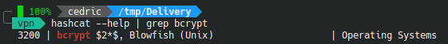

Pour cracker le hash: 

	hashcat -m 3200 hash wordlist -r /usr/share/hashcat/rules/d3ad0ne.rule --force -o crack.txt

Nous avons maintenant le mot de passe root enregistré dans un fichier crack.txt qu'il ne nous reste plus qu'à lire ! 

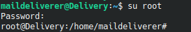
